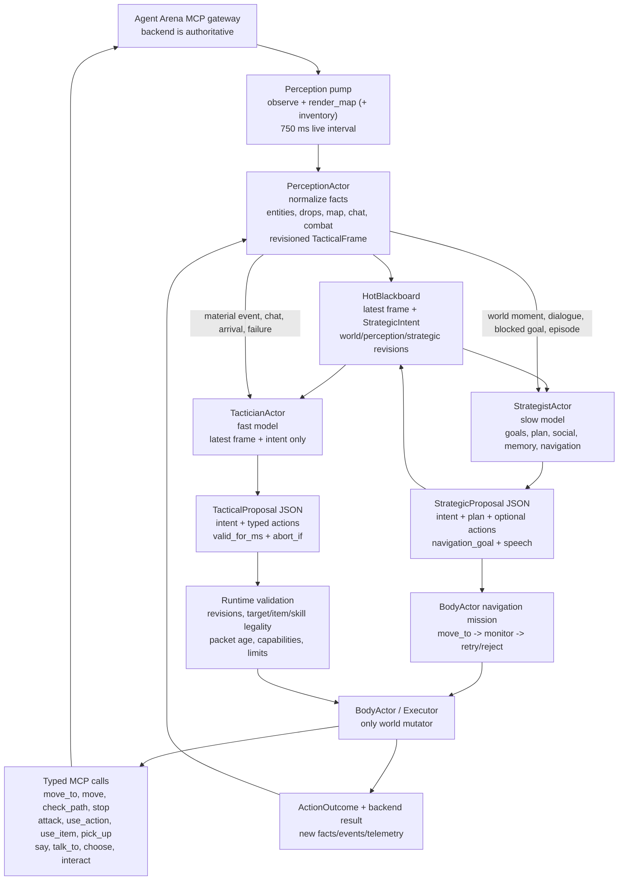
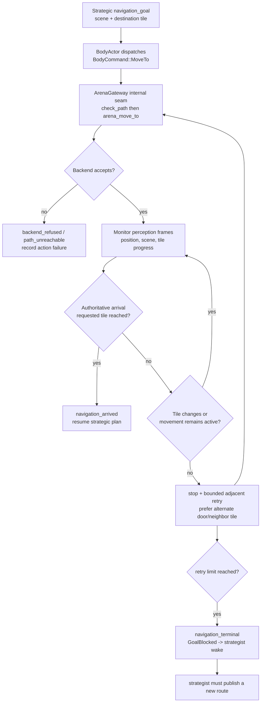

# Live Brain Control Flow

This is the control flow currently used by Guy's Rust runtime. It describes
the live implementation, including the points where a model output can be
discarded or a movement can be rejected.

## Whole-player flow



## Strategist loop

```mermaid
sequenceDiagram
    participant W as Perception/Memory
    participant S as StrategistActor
    participant R as Rig/OpenRouter
    participant B as Blackboard
    participant E as BodyActor

    W->>S: WorldMoment / PersonSpoke / GoalBlocked / Reflect
    S->>S: coalesce latest moments; preserve durable working plan
    S->>R: StrategicInput JSON + bounded history + recall
    Note over S,R: live Guy timeout: 45s; output budget: 4,000 tokens; reasoning medium/on; no MCP calls
    R-->>S: exactly one StrategicProposal JSON
    S->>S: deserialize + semantic validation + revision stamp
    alt proposal is stale or invalid
        S-->>B: discard and emit causal telemetry
    else proposal accepted
        S->>B: publish StrategicIntent revision
        S->>E: optional Think, Say, TalkTo, Interact, PursueNavigation
    end
```

Strategic output is not a button loop. The strategist may request a durable
navigation destination, but the BodyActor owns path checks, movement monitoring,
door handling, retries, and cancellation.

## Tactical loop

```mermaid
sequenceDiagram
    participant P as PerceptionActor
    participant T as TacticianActor
    participant R as Rig/OpenRouter
    participant V as Validator
    participant B as BodyActor
    participant M as MCP

    P->>T: material wake or heartbeat
    T->>T: capture frame_revision + strategic_revision
    T->>R: TacticalInput JSON
    Note over T,R: Gemini Flash Lite; timeout 30s; max output 150 tokens; max rate 5 Hz; idle heartbeat 0.2 Hz
    R-->>T: TacticalProposal JSON
    T->>T: reject if inference failed or revisions are stale
    T->>V: ActionPacket with runtime metadata
    V->>V: capabilities, freshness, target, item, skill, path facts
    alt rejected
        V-->>P: action refusal + telemetry
    else accepted
        V->>B: ExecuteTactical packet
        loop each action, with freshness check between actions
            B->>M: one typed MCP mutation
            M-->>B: typed result
            B->>P: ActionOutcome / event
            P-->>B: material invalidation or preemption
        end
    end
```

The tactician cannot call MCP directly and cannot provide `agent_id`, revision
metadata, correlation IDs, or validation metadata. The runtime adds those.

## Movement mission and rejection path



Important current detail: `arena_move_to` is the intended movement primitive.
`arena_move` is only used for bounded recovery after a monitored stall. A
backend response that merely says a command was accepted does not count as
arrival; the perception frame must confirm the destination tile.

## Tool ownership

| Capability | Strategist | Tactician | BodyActor / gateway |
| --- | --- | --- | --- |
| Observe/map/inventory | indirect facts | indirect facts | yes, read-only MCP |
| Choose destination | yes | local reposition only | executes |
| `arena_move_to` | no direct call | no direct call | yes |
| `arena_move` | no direct call | no direct call | recovery only |
| `arena_check_path` | no direct call | no direct call | yes |
| Stop/unstick/door | intent only | intent only | yes, validated |
| Attack/skill/item/loot | no | typed action | yes, validated |
| Say/talk/choose/interact | proposal | no normal dialogue | yes, validated |
| Agent identity | never supplied | never supplied | runtime-bound |

## Current limits and failure gates

- Strategic inference is one in flight at a time; new moments coalesce rather
  than creating an unbounded queue.
- Tactical inference uses latest-value semantics; stale results are discarded.
- Tactical proposals allow 100–5,000 ms validity in the schema, while the live
  packet-age gate is configured to 5,000 ms and the live packet action count is
  capped by `NPC_LIVE_MAX_ACTIONS_PER_PACKET`.
- A tactical proposal with `intent: continue` cannot contain actions.
- Movement targets must be finite, in the current scene, and pass runtime
  validation. The validator does not choose a destination for the model.
- Backend `accepted` is not authoritative arrival. Arrival requires a matching
  authoritative position frame.
- Chat is normalized from both `chat` and `recentChat`, de-duplicated, filtered
  only for engine chatter/feeling pings, then forwarded as strategist moments.
- Provider reasoning is separate from explicit `arena_think`; the runtime does
  not treat a model's reasoning text as a body action.

## The suspicious seam for the current live failure

The trace currently shows a valid-looking strategic destination `(23,16)` and
then an MCP refusal, followed by a recovery destination `(22,15)` and another
refusal. Other agents succeeding does not prove these targets are valid for
Guy's current body geometry. The next diagnostic should capture, for each
movement attempt, the exact:

1. current pixel and tile position;
2. requested tile and pixel target sent to MCP;
3. `arena_check_path` response;
4. `arena_move_to` response;
5. authoritative position immediately afterward;
6. scene/door geometry and character collision dimensions.

That comparison will tell us whether the model selected a bad tile, the tile
translation is wrong, or Guy's body/session has a different coordinate or
collision state than the other agents.
