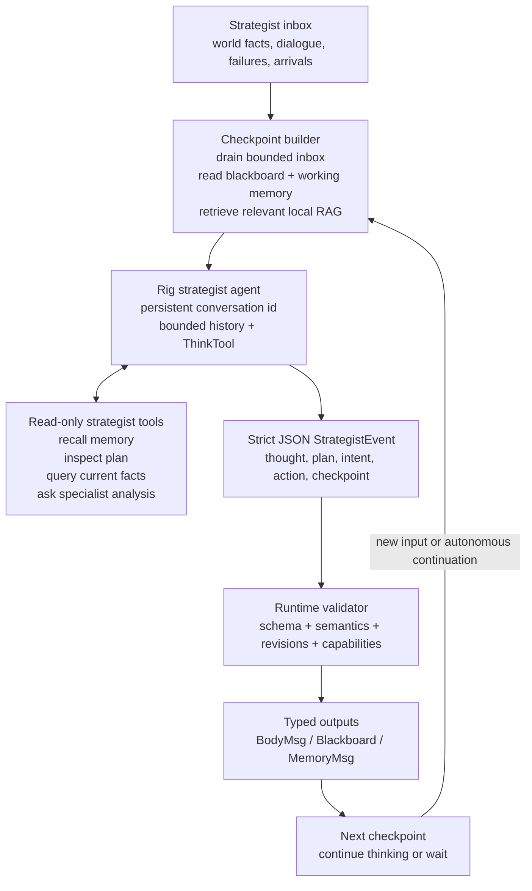

# Strategist as a Persistent Agentic Thinker

## Decision

The strategist should become a long-lived agentic loop. It should not be
treated as a stateless function that receives one event and returns one plan.
Ractor remains responsible for lifecycle and concurrency. Rig should own the
strategist's bounded conversation, tool loop, structured output, and memory
integration.

The strategist's actor mailbox becomes an input stream. Incoming world facts,
dialogue, blocked goals, arrivals, episode summaries, and explicit reflections
are appended to a typed inbox. They wake the thinker or become available at
the next checkpoint; they do not start unrelated conversations.

Outputs are also stream-like. The thinker may emit a durable plan update, a
strategic intent update, a body command, a speech request, or a checkpoint.
The actor validates and routes each typed output. The thinker never receives a
mutable MCP client.

## Target loop



## Input contract

The agent receives a typed checkpoint document, not an unbounded transcript:

```json
{
  "protocol_version": 2,
  "checkpoint_id": "uuid",
  "character_id": "guy",
  "inbox": [
    {
      "kind": "person_spoke",
      "speaker": "Portland",
      "channel": "scene",
      "summary": "Two here. Three made. Thirty-seven still unmatched."
    }
  ],
  "current_intent": {},
  "working_memory": {},
  "world_snapshot": {},
  "recalled_memory": [],
  "open_plan_steps": []
}
```

Facts are explicitly marked as observations. They are not inserted into the
system prompt as instructions.

## Output contract

The agent must return one or more typed events inside a single strict JSON
envelope. The runtime owns IDs, revisions, timestamps, and correlation data.

```json
{
  "protocol_version": 2,
  "checkpoint_id": "uuid",
  "continue_thinking": true,
  "events": [
    {
      "type": "thought_checkpoint",
      "summary": "The downstairs route is blocked; compare the two door tiles before changing the goal."
    },
    {
      "type": "navigation_goal",
      "scene": "reldens-house-1",
      "destination": { "tile_x": 24, "tile_y": 16 },
      "reason": "Use the known exit to leave the inn."
    }
  ]
}
```

`thought_checkpoint` is an intentional, spectator-visible summary. It is not
raw provider chain-of-thought. Provider reasoning is captured separately by
the model observability layer when configured.

## Tool boundary

The strategist agent may use Rig tools for:

- bounded local memory recall;
- reading the current typed world snapshot;
- reading the current plan and goal evidence;
- comparing known routes and prior movement failures;
- specialist analysis that cannot mutate the game.

The strategist agent may not directly call movement, combat, inventory,
dialogue, or session MCP tools. Those are emitted as typed events and executed
by BodyActor after validation.

## Checkpoint rules

- New inputs are latest-value/coalesced where facts supersede one another.
- Dialogue and important failures remain ordered and bounded.
- A checkpoint may continue autonomously for a small configured number of
  turns, then must yield to the actor scheduler.
- A new material combat event interrupts strategic continuation but does not
  erase the durable plan.
- A stale output cannot mutate the blackboard or body.
- A provider timeout ends the checkpoint and preserves the last valid intent.
- A memory/tool failure is reported as a tool result; it does not terminate
  the player session.

## Migration from the current actor

The current `StrategistActor` already has useful pieces: a bounded moment
inbox, coalescing, revision checks, Rig conversation memory, semantic output
validation, and typed BodyActor messages. The migration should preserve those
pieces while replacing the one-call `Brain<StrategicInput, StrategicProposal>`
step with a persistent `StrategistAgentSession`.

1. Introduce typed `StrategicCheckpoint` and `StrategicEvent` schemas.
2. Add a Rig agent-session abstraction with bounded conversation memory.
3. Add read-only strategist tools backed by actor RPC, never MCP mutation.
4. Make one checkpoint able to produce multiple validated events.
5. Add autonomous continuation with a strict turn and time budget.
6. Keep the existing proposal adapter as a compatibility mode for replay and
   rollback.
7. Record every checkpoint, tool call, event, validation result, and emitted
   body command in the existing causal analytics chain.

## Why this addresses the current failure

The current strategist can spend a full provider timeout in a single isolated
decision while movement failures accumulate in a separate queue. A persistent
checkpoint loop can inspect the movement refusal, compare the exact target and
path facts, revise the navigation event, and continue from the same working
thought instead of waiting for an unrelated periodic prompt. The body still
owns execution, so making the strategist agentic does not weaken mutation
safety.
